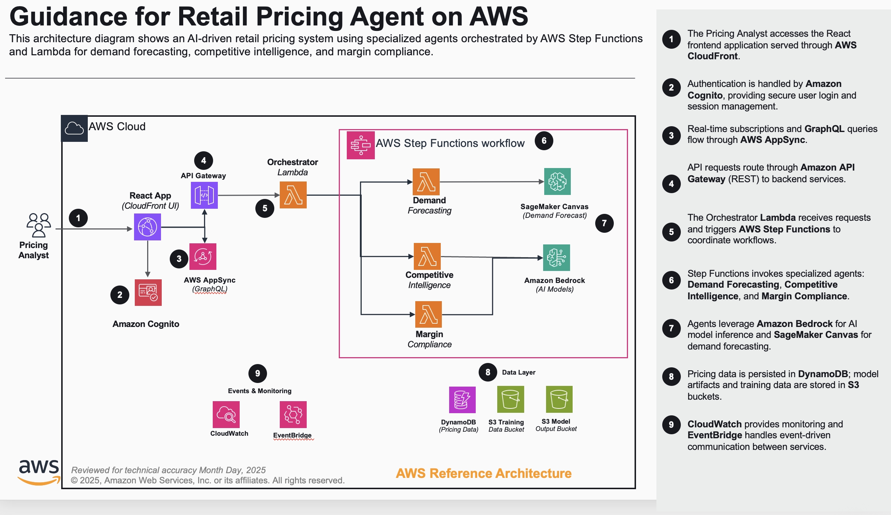

# Guidance for Retail Pricing Agent Orchestration on AWS

## Table of Contents

1. [Overview](#overview)
    - [Architecture](#architecture)
    - [Cost](#cost)
2. [Prerequisites](#prerequisites)
    - [Operating System](#operating-system)
    - [Third-Party Tools](#third-party-tools)
    - [AWS Account Requirements](#aws-account-requirements)
    - [AWS CDK Bootstrap](#aws-cdk-bootstrap)
    - [Supported Regions](#supported-regions)
3. [Automated Deployment](#automated-deployment)
4. [Manual Deployment](#manual-deployment)
5. [Deployment Validation](#deployment-validation)
6. [Running the Guidance](#running-the-guidance)
7. [Next Steps](#next-steps)
8. [Cleanup](#cleanup)
9. [FAQ, Known Issues, Additional Considerations, and Limitations](#faq-known-issues-additional-considerations-and-limitations)
10. [Notices](#notices)
11. [Authors](#authors)

## Overview

This Guidance demonstrates how to build an AI-powered retail pricing system that orchestrates multiple specialized agents to deliver comprehensive pricing analysis and recommendations. It addresses the challenge of making data-driven pricing decisions by combining demand forecasting, competitive intelligence, and margin compliance into a unified workflow.

The system uses **Amazon Bedrock** foundation models to power three specialized agents — demand forecast, competitive analysis, and margin analysis — coordinated through **AWS Step Functions**. A React-based dashboard built with **AWS Amplify** and the **Cloudscape Design System** provides an interactive interface for browsing products, initiating pricing analyses, and reviewing AI-generated recommendations in real time via **AWS AppSync** GraphQL subscriptions.

### Architecture



The architecture works as follows:

1. The Pricing Analyst accesses the React frontend application served through **AWS CloudFront**, authenticating via **Amazon Cognito**. The analyst browses the product catalog, selects products for pricing analysis, and receives AI-generated pricing recommendations with demand forecasts, competitive positioning, and margin compliance assessments.
2. The frontend communicates with **AWS AppSync** (GraphQL API) for product catalog queries, pricing analysis requests, and real-time subscriptions.
3. When a pricing analysis is requested, an **AWS Lambda** resolver triggers an **AWS Step Functions** state machine that orchestrates the multi-agent workflow.
4. **AWS Step Functions** invokes three specialized **AWS Lambda** functions in parallel, each implementing a custom agent using Strands framework: demand forecast, competitive analysis, and margin analysis.
5. **Amazon SageMaker Canvas** provides ML-based demand forecasting models trained on historical sales data stored in **Amazon S3**.
6. Product catalog data and orchestration state are persisted in **Amazon DynamoDB** tables.
7. Agents leverage **Amazon Bedrock**, a fully managed service for generative AI applications with foundation models from leading AI companies, and **Amazon SageMaker Canvas** for demand forecasting.
8. Product images and competitive data assets are served through **Amazon CloudFront** backed by **Amazon S3**.
9. **Amazon EventBridge** handles event-driven communication between pricing analysis components.
10. **Amazon CloudWatch** dashboards and alarms provide real-time monitoring of the system.

### Cost

_You are responsible for the cost of the AWS services used while running this Guidance. As of February 2026, the cost for running this Guidance with the default settings in the US East (N. Virginia) Region is approximately $350.00 per month for processing 10,000 pricing analysis requests._

The following table provides a sample cost breakdown for deploying this Guidance with the default parameters in the US East (N. Virginia) Region for one month.

| AWS Service | Dimensions | Cost [USD] |
| --- | --- | --- |
| Amazon SageMaker Canvas | 1 domain, model training and inference | $ 150.00 |
| Amazon Bedrock | 10,000 requests across 3 agents (Claude models) | $ 80.00 |
| AWS Step Functions | 10,000 state machine executions | $ 2.50 |
| AWS Lambda | 40,000 invocations, 512 MB, avg 5s duration | $ 3.30 |
| Amazon DynamoDB | 3 tables, on-demand, ~50 GB storage | $ 25.00 |
| AWS AppSync | 100,000 GraphQL operations, real-time subscriptions | $ 4.00 |
| Amazon CloudFront | 100 GB data transfer, 500,000 requests | $ 10.00 |
| Amazon S3 | 50 GB storage (assets, training data, model outputs) | $ 1.15 |
| Amazon Cognito | 1,000 active users | $ 0.00 |
| AWS Amplify Hosting | Build and hosting | $ 5.00 |
| Amazon EventBridge | 50,000 events | $ 0.05 |
| Amazon CloudWatch | Dashboards, alarms, logs | $ 10.00 |
| Amazon VPC | NAT Gateway for SageMaker Canvas VPC | $ 55.00 |

_We recommend creating a [Budget](https://docs.aws.amazon.com/cost-management/latest/userguide/budgets-managing-costs.html) through [AWS Cost Explorer](https://aws.amazon.com/aws-cost-management/aws-cost-explorer/) to help manage costs. Prices are subject to change. For full details, refer to the pricing webpage for each AWS service used in this Guidance._

## Prerequisites

### Operating System

These deployment instructions are optimized to best work on **Amazon Linux 2023 AMI**. Deployment on macOS or other Linux distributions may require additional steps.

### Third-Party Tools

- **Node.js** 18.x or higher — [Install Node.js](https://nodejs.org/)
- **npm** 9.x or higher (included with Node.js)
- **AWS CLI** 2.x — [Install AWS CLI](https://docs.aws.amazon.com/cli/latest/userguide/getting-started-install.html)
- **AWS CDK** 2.x — installed automatically during setup, or install manually:
  ```bash
  npm install -g aws-cdk
  ```
- **TypeScript** 5.x — installed as a project dependency
- **Git** — for cloning the repository

### AWS Account Requirements

- An active AWS account with permissions to create the following resources:
  - Amazon Cognito User Pools
  - Amazon DynamoDB tables
  - AWS Lambda functions
  - AWS AppSync GraphQL APIs
  - Amazon S3 buckets
  - Amazon CloudFront distributions
  - AWS Step Functions state machines
  - Amazon SageMaker domains and user profiles
  - Amazon Bedrock model access (Claude models)
  - Amazon EventBridge event buses
  - Amazon CloudWatch dashboards and alarms
  - AWS Amplify applications
  - Amazon VPC (for SageMaker Canvas)
  - IAM roles and policies
- **Amazon Bedrock model access**: Enable access to Anthropic Claude models in the target Region. Navigate to the Amazon Bedrock console, choose **Model access**, and request access to:
  - `anthropic.claude-3-5-haiku-20241022-v1:0`
  - `us.anthropic.claude-sonnet-4-20250514-v1:0`
  - `us.anthropic.claude-sonnet-4-5-20250929-v1:0`

### AWS CDK Bootstrap

This Guidance uses AWS CDK. If you are using AWS CDK for the first time in your account and Region, perform the following bootstrapping:

```bash
npx cdk bootstrap aws://YOUR_ACCOUNT_ID/us-east-1
```

Replace `YOUR_ACCOUNT_ID` with your 12-digit AWS account ID. Find your account ID by running:

```bash
aws sts get-caller-identity --query Account --output text
```

### Supported Regions

This Guidance is best suited for deployment in **US East (N. Virginia) `us-east-1`**.

## Automated Deployment

A one-click deploy script (`deploy.sh`) automates the entire deployment process. It handles dependency installation, CDK bootstrapping, AgentCore agent deployment, infrastructure creation, data loading, and frontend deployment.

**Prerequisites:**
- AWS credentials configured (`aws sso login` or environment variables)
- Docker running (required for CDK Lambda bundling)
- `jq` installed (used for JSON configuration)

**Usage:**

```bash
# Clone the repository
git clone https://github.com/aws-solutions-library-samples/guidance-for-retail-pricing-agent-on-aws.git
cd guidance-for-retail-pricing-agent-on-aws

# Make the script executable and run it
chmod +x deploy.sh
./deploy.sh
```

**What the script does:**

| Step | Description |
| --- | --- |
| 1 | Installs global dependencies (AWS CDK, TypeScript) |
| 2 | Sets working directory to the repository root |
| 3 | Installs project dependencies (backend, frontend, shared) |
| 4 | Creates and configures `local.json` with your AWS account and Region |
| 5 | Bootstraps AWS CDK if not already done |
| 6 | Deploys three Amazon Bedrock AgentCore agents (demand forecast, competitive analysis, margin analysis) |
| 7 | Deploys backend CDK stacks (DynamoDB, AppSync, Step Functions, SageMaker Canvas, Cognito, CloudFront, etc.) and frontend hosting stack (Amplify) |
| 8 | Uploads pre-built product images to S3 and loads product catalog data, competitive data, margin rules, and demand forecasts to S3 and DynamoDB |
| 9–10 | Syncs frontend configuration with backend outputs, builds the React app, and deploys to AWS Amplify |
| 11 | Creates a demo user in Cognito (`demo@example.com` / `Demo1234!`) |
| 12 | Validates that all CloudFormation stacks are healthy and outputs the application URL |

**Estimated deployment time:** 15–20 minutes (SageMaker Canvas domain creation accounts for most of this on first deploy).

**Environment:**
- Designed for Amazon Linux 2023 (AWS CodeBuild or EC2)
- Also works on macOS and other Linux distributions with Node.js 18+, Docker, and configured AWS credentials

**Note:** For a detailed understanding of each deployment step, see the [Manual Deployment](#manual-deployment) section below.

## Manual Deployment

This section provides step-by-step instructions for manual deployment. Use this if you want to understand each step in detail or customize the deployment process.

1. Clone the repository:
   ```bash
   git clone https://github.com/aws-solutions-library-samples/guidance-for-retail-pricing-agent-on-aws.git
   ```

2. Navigate to the repository directory:
   ```bash
   cd guidance-for-retail-pricing-agent-on-aws
   ```

3. Install root dependencies:
   ```bash
   npm install
   ```

4. Install frontend dependencies:
   ```bash
   cd source/frontend
   npm install
   cd ../..
   ```

5. Install backend dependencies:
   ```bash
   cd source/backend
   npm install
   cd ../..
   ```

6. Copy the local configuration template and update it with your AWS account details:
   ```bash
   cp source/backend/config/local.json.template source/backend/config/local.json
   ```
   Edit `source/backend/config/local.json` and replace:
   - `YOUR_AWS_ACCOUNT_ID` with your 12-digit AWS account ID
   - `YOUR_PREFERRED_REGION` with your target Region (e.g., `us-east-1`)

7. Bootstrap AWS CDK (first time only):
   ```bash
   cd source/backend
   npm run bootstrap:local
   cd ../..
   ```

8. Deploy the backend infrastructure:
   ```bash
   npm run deploy:backend:local
   ```
   This deploys the CDK stacks, loads product catalog data, and configures SageMaker Canvas.

9. Capture the deployed resource outputs:
   ```bash
   cd source/backend
   npm run test:stack:outputs:local
   cd ../..
   ```
   Note the following outputs for frontend configuration:
   - `UserPoolId`
   - `UserPoolClientId`
   - `GraphQLApiUrl`
   - `GraphQLApiKey`
   - `AmplifyAppId`
   - `AmplifyAppUrl`

10. Update the frontend configuration with backend outputs:
    ```bash
    npm run sync:frontend:local
    ```

11. Build and deploy the frontend:
    ```bash
    npm run deploy:frontend:local
    ```

12. Access the application at the Amplify App URL from the stack outputs.

## Deployment Validation

Verify the deployment was successful by performing the following checks:

1. Verify the CloudFormation stacks are in `CREATE_COMPLETE` status:
   ```bash
   aws cloudformation describe-stacks --query "Stacks[?contains(StackName, 'ProductCatalog')].{Name:StackName,Status:StackStatus}" --output table
   ```

2. Verify the DynamoDB tables exist and contain data:
   ```bash
   aws dynamodb describe-table --table-name product-catalog-local --query "Table.{Name:TableName,Status:TableStatus,ItemCount:ItemCount}" --output table
   ```

3. Verify the Cognito User Pool is active:
   ```bash
   aws cognito-idp list-user-pools --max-results 10 --query "UserPools[?contains(Name, 'product-catalog')].{Name:Name,Id:Id,Status:Status}" --output table
   ```

4. Verify the AppSync API is available:
   ```bash
   aws appsync list-graphql-apis --query "graphqlApis[?contains(name, 'ProductCatalog')].{Name:name,ApiId:apiId}" --output table
   ```

5. Run the deployment verification script:
   ```bash
   npm run verify:deployment:local
   ```

## Running the Guidance

After successful deployment, follow these steps to use the pricing analysis system:

1. Open the Amplify App URL in your browser (from the deployment outputs).

2. Sign in with the demo account created during deployment (`demo@example.com` / `Demo1234!`), or create a new user account using the sign-up form.

3. The product catalog dashboard loads, displaying power tool products organized by tier (Premium, Professional, Standard, Economy).

5. Browse products using the category selector and search filters. Select a product to view its details.

6. Initiate a pricing analysis by selecting a product and choosing **Analyze Pricing**. The system orchestrates three AI agents:
   - **Demand Forecast Agent**: Analyzes historical sales data and predicts future demand
   - **Competitive Analysis Agent**: Evaluates market positioning and competitor pricing
   - **Margin Analysis Agent**: Validates pricing against margin compliance rules

7. Monitor the analysis progress in real time through the chat panel, which displays agent messages as they complete via AppSync subscriptions.

8. Review the comprehensive pricing recommendation, which includes demand projections, competitive positioning, margin compliance status, and a suggested price range.

## Next Steps

Consider the following customizations to extend this Guidance for your use case:

- Add additional product categories by updating the product catalog data and SageMaker Canvas model categories in the configuration file.
- Customize the Bedrock agent prompts in the multi-agent orchestrator construct to align with your specific pricing strategy.
- Enable production monitoring by setting `monitoring.enabled: true` and providing an `alertEmail` in the configuration.
- Integrate with your existing product information management (PIM) system by extending the AppSync resolvers.
- Adjust SageMaker Canvas training schedules and performance thresholds for your data volume and accuracy requirements.
- Extend the Step Functions workflow to include additional analysis agents (e.g., promotional pricing, bundle analysis).

## Cleanup

To remove all resources created by this Guidance, follow these steps:

1. Empty the S3 buckets (CloudFormation cannot delete non-empty buckets):
   ```bash
   ASSETS_BUCKET=$(aws cloudformation describe-stacks --stack-name ProductCatalog-local --query "Stacks[0].Outputs[?OutputKey=='AssetsBucketName'].OutputValue" --output text)
   TRAINING_BUCKET=$(aws cloudformation describe-stacks --stack-name ProductCatalog-local --query "Stacks[0].Outputs[?OutputKey=='CanvasTrainingDataBucket'].OutputValue" --output text)
   MODEL_BUCKET=$(aws cloudformation describe-stacks --stack-name ProductCatalog-local --query "Stacks[0].Outputs[?OutputKey=='CanvasModelOutputBucket'].OutputValue" --output text)

   aws s3 rm s3://$ASSETS_BUCKET --recursive
   aws s3 rm s3://$TRAINING_BUCKET --recursive
   aws s3 rm s3://$MODEL_BUCKET --recursive
   ```

2. Delete the SageMaker Canvas domain (if not automatically removed):
   ```bash
   DOMAIN_ID=$(aws cloudformation describe-stacks --stack-name ProductCatalog-local --query "Stacks[0].Outputs[?OutputKey=='SageMakerCanvasDomainId'].OutputValue" --output text)
   aws sagemaker delete-domain --domain-id $DOMAIN_ID --retention-policy HomeEfsFileSystem=Delete
   ```

3. Destroy the CDK stacks:
   ```bash
   cd source/backend
   npx cdk destroy --all --context environment=local --force
   cd ../..
   ```

4. Verify all resources have been removed:
   ```bash
   aws cloudformation list-stacks --query "StackSummaries[?contains(StackName, 'ProductCatalog') && StackStatus!='DELETE_COMPLETE'].{Name:StackName,Status:StackStatus}" --output table
   ```

5. Delete the Amplify frontend deployment bucket if it remains:
   ```bash
   DEPLOY_BUCKET=$(aws cloudformation describe-stacks --stack-name FrontendHosting-local --query "Stacks[0].Outputs[?OutputKey=='DeploymentBucket'].OutputValue" --output text 2>/dev/null)
   if [ -n "$DEPLOY_BUCKET" ]; then
     aws s3 rm s3://$DEPLOY_BUCKET --recursive
   fi
   ```

## FAQ, Known Issues, Additional Considerations, and Limitations

**Known Issues**

- SageMaker Canvas domain creation can take 15–20 minutes during initial deployment. Subsequent deployments are faster.
- If the CDK deployment fails due to SageMaker domain limits, delete any existing SageMaker domains in the target Region before retrying.

**Additional Considerations**

- This Guidance creates a VPC with a NAT Gateway for SageMaker Canvas, which incurs hourly charges even when idle. Consider deploying with `enableVpc: false` in the configuration if VPC isolation is not required.
- DynamoDB tables use on-demand (PAY_PER_REQUEST) billing mode. For predictable workloads, consider switching to provisioned capacity for cost optimization.
- Amazon Bedrock model invocations are billed per token. Monitor usage through CloudWatch metrics and set billing alarms to avoid unexpected costs.
- Product images are pre-built and included in the repository (`source/shared/data/product-images/`). During deployment, these images are uploaded to S3 and served through CloudFront.
- The Cognito User Pool allows self-registration by default. For production deployments, consider restricting sign-up or adding admin approval workflows.

**Limitations**

- The Guidance currently supports power tool product categories. Extending to other categories requires updating the product data schema and retraining SageMaker Canvas models.
- Real-time pricing subscriptions require an active WebSocket connection through AppSync. Disconnected clients need to refresh to receive missed updates.

For any feedback, questions, or suggestions, use the [Issues](https://github.com/aws-solutions-library-samples/guidance-for-retail-pricing-agent-on-aws/issues) tab in this repository.

## Notices

*Customers are responsible for making their own independent assessment of the information in this Guidance. This Guidance: (a) is for informational purposes only, (b) represents AWS current product offerings and practices, which are subject to change without notice, and (c) does not create any commitments or assurances from AWS and its affiliates, suppliers or licensors. AWS products or services are provided "as is" without warranties, representations, or conditions of any kind, whether express or implied. AWS responsibilities and liabilities to its customers are controlled by AWS agreements, and this Guidance is not part of, nor does it modify, any agreement between AWS and its customers.*

## Authors

- Pricing Team
