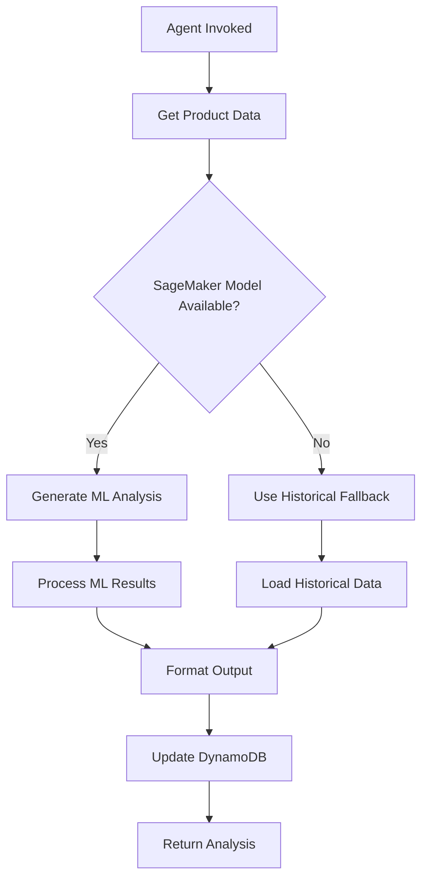
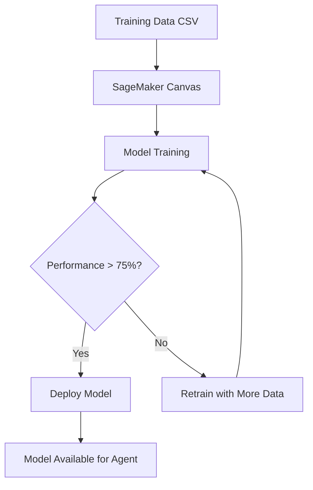

# Competitive Intelligence Data Structure Overview

## Purpose

This document provides a comprehensive overview of the competitive intelligence data structure implemented for the Competitive Analysis Agent. The structure supports both historical fallback data and SageMaker Canvas ML model training data.

## Architecture Overview

```
src/shared/data/
├── competitive_data/                    # Historical fallback data
│   ├── README.md                       # Documentation for fallback data
│   ├── schema.json                     # JSON schema for competitive analysis
│   ├── CMAN-SAW-PRO725.json          # Sample: Craftsman saw (best tier)
│   ├── DEWALT-DRILL-DCD771C2.json    # Sample: DeWalt drill (better tier)
│   ├── RYOBI-SANDER-P411.json        # Sample: Ryobi sander (good tier)
│   ├── HARBOR-GRINDER-62281.json     # Sample: Harbor Freight grinder (entry tier)
│   ├── KITCHENAID-MIXER-M002.json    # Sample: KitchenAid mixer (best tier)
│   └── PROCTOR-TOASTER-T004.json     # Sample: Proctor Silex toaster (entry tier)
├── competitive_training_data/           # SageMaker Canvas training data
│   ├── README.md                       # Documentation for training data
│   ├── powertools/                     # Power tools category training data
│   │   ├── training_schema.json        # Schema for powertools training data
│   │   ├── saws_training_data.csv      # Training data for circular saws
│   │   ├── drills_training_data.csv    # Training data for drills
│   │   ├── sanders_training_data.csv   # Training data for sanders
│   │   └── grinders_training_data.csv  # Training data for grinders
│   └── kitchen/                        # Kitchen appliances category training data
│       ├── training_schema.json        # Schema for kitchen training data
│       └── mixers_training_data.csv    # Training data for stand mixers
└── COMPETITIVE_DATA_OVERVIEW.md        # This overview document
```

## Data Flow and Usage

### 1. Competitive Analysis Agent Workflow



### 2. SageMaker Canvas Model Training



## Key Design Principles

### 1. Fallback Strategy
- **Primary**: SageMaker Canvas ML models for real-time analysis
- **Secondary**: Historical competitive data when ML unavailable
- **Confidence Adjustment**: Reduced confidence scores for historical data

### 2. Category-Specific Models
- Separate ML models for each product category (powertools, kitchen, etc.)
- Category-specific training data and schemas
- Tailored feature engineering for each category

### 3. Confidence Intervals
- **ML Models**: High confidence (0.82-0.95)
- **Historical Data**: Reduced confidence (0.63-0.78)
- **Transparent Scoring**: Clear indication of data source and reliability

### 4. Data Quality Metrics
- Freshness tracking (days since last update)
- Sample size indicators
- Completeness scores
- Outlier exclusion counts

## Implementation Requirements Satisfied

This structure satisfies the following requirements from the competitive intelligence specification:

### Requirement 1.1-1.7: Product Data Retrieval
- ✅ Product ID mapping to competitive analysis files
- ✅ Error handling for missing data
- ✅ Retry logic support through structured data
- ✅ Validation of data structure and completeness

### Requirement 2.1-2.7: SageMaker Canvas Integration
- ✅ Training data structure for ML model development
- ✅ Category-specific model support
- ✅ Confidence interval tracking
- ✅ Fallback data when models unavailable

### Requirement 2.4-2.6: Historical Data Fallback
- ✅ Structured historical competitive data
- ✅ Reduced confidence scoring for historical data
- ✅ Same output format as ML analysis

## Data Maintenance Procedures

### Monthly Updates
1. **Price Data Refresh**: Update competitor pricing in training data
2. **Market Share Updates**: Refresh market share estimates
3. **Feature Analysis**: Review and update competitive advantages
4. **Quality Metrics**: Update data freshness and completeness scores

### Quarterly Reviews
1. **Strategy Validation**: Review recommended strategies against market performance
2. **Confidence Calibration**: Adjust confidence intervals based on prediction accuracy
3. **Competitor Analysis**: Add/remove competitors based on market changes
4. **Model Performance**: Evaluate ML model accuracy and retrain if needed

### Annual Assessments
1. **Schema Updates**: Evolve data schemas based on new requirements
2. **Category Expansion**: Add new product categories and training data
3. **Brand Strength Scoring**: Update brand strength assessments
4. **Market Position Validation**: Validate market position classifications

## Integration Points

### 1. Competitive Analysis Agent
- Reads historical data from `competitive_data/` folder
- Uses product_id for direct file mapping
- Applies confidence reduction for historical data
- Validates data structure against schema

### 2. SageMaker Canvas Models
- Trains on CSV data from `competitive_training_data/` folders
- Uses category-specific schemas and features
- Generates ML-based competitive analysis
- Provides high-confidence recommendations

### 3. S3 Storage (Production)
- Historical data stored in S3 `competitive_data/` prefix
- Training data stored in S3 `competitive_training_data/` prefix
- Organized by category for efficient model training
- Versioned for change tracking and rollback

## Future Enhancements

### 1. Real-Time Data Integration
- API connections to competitive pricing services
- Automated data refresh pipelines
- Real-time market volatility tracking

### 2. Advanced ML Features
- Deep learning models for pattern recognition
- Multi-category cross-learning
- Predictive competitive modeling

### 3. Enhanced Analytics
- Competitive trend analysis
- Market share prediction
- Brand strength evolution tracking

### 4. Automated Quality Assurance
- Data validation pipelines
- Anomaly detection for pricing data
- Automated confidence calibration

This comprehensive structure provides a solid foundation for competitive intelligence while supporting both immediate fallback needs and advanced ML-driven analysis capabilities.